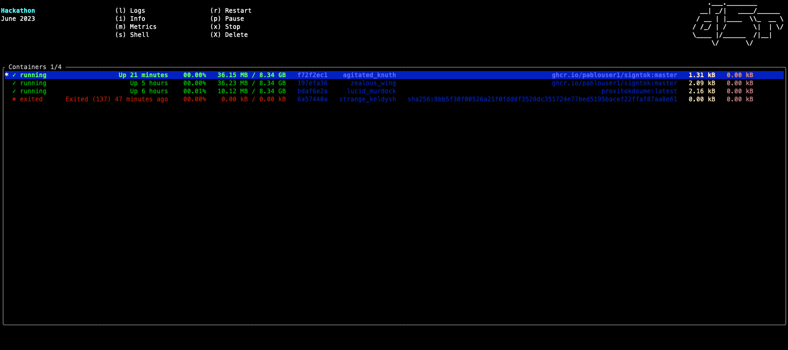

<p align="center">
	<h1 align="center">d5r</h1>
	<div align="center">A simple tui to view & control docker containers</div>
</p>

<p align="center">
	Built in <a href='https://www.rust-lang.org/' target='_blank' rel='noopener noreferrer'>Rust</a>, making heavy use of <a href='https://github.com/tui-rs-revival/ratatui' target='_blank' rel='noopener noreferrer'>ratatui</a> & <a href='https://github.com/fussybeaver/bollard' target='_blank' rel='noopener noreferrer'>Bollard</a>
</p>

<p align="center">
	<a href="https://raw.githubusercontent.com/mrjackwills/oxker/main/.github/screenshot_01.png" target='_blank' rel='noopener noreferrer'>
		
	</a>
</p>

<h3>As k9s allow to manage kubernetes cluster, d5r uses the same kind of interface to manage Docker</h3>

## Demo
https://youtu.be/5QjwraW-qjw

## Value prop
Ease docker usage running commands from a TUI

## Features
- manage docker containers (pause, unpause, delete, start, stop)
- show logs for each container
- display metrics (CPU / mem) over time
- launch sh into container

## Improvements / TODOs
- Add containers features (commit with new run command, etc..)
- Manage services
- Manage images

## Notes
Based on a fork from https://github.com/mrjackwills/oxker


## Run

### Cargo

```shell
cargo run
```
